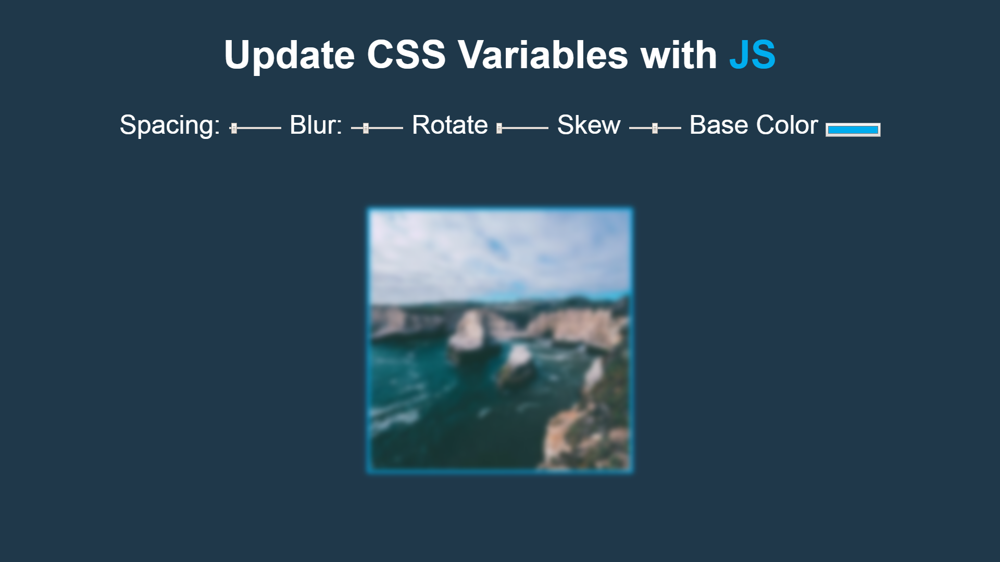
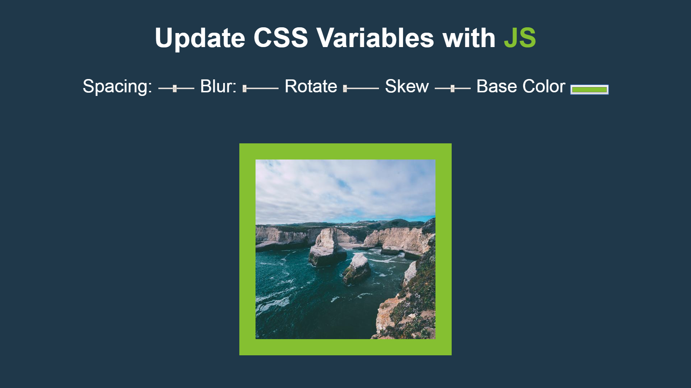
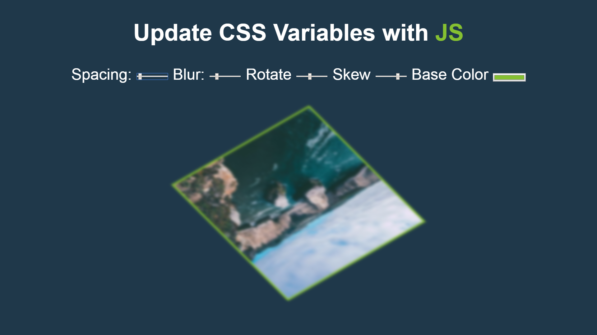

 
# Playing with CSS Variables

#### Exploring CSS variable interaction with JavaScript

Use JavaScript to update CSS variables and have its results shown on screen.
An random image is rendered with control inputs for the user to interact with that will alter the image.
Alterations include blur, spacing, rotation, color and skew.

### Screenshots
---
> **The default look**

> **Applied transformations: Spacing, Blur, Color**

> **Applied transformations: Spacing, Blur, Rotate, Skew, Color**

### Demo
---

