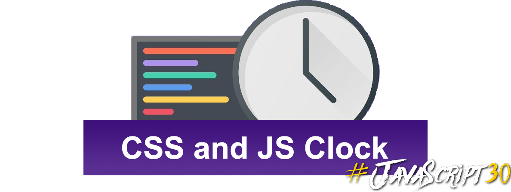

# CSS and JavaScript Clock

#### Analog clock designed in CSS and functionalities written in JavaScript.

Simple webpage that displays a functional analog clock built in CSS and JavaScript.

### Screenshot
---
> **The default look**

### Demo
---

