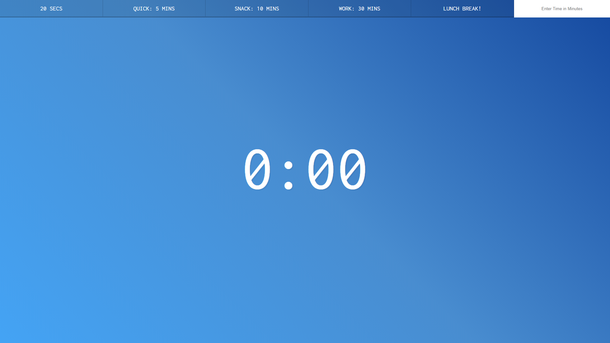
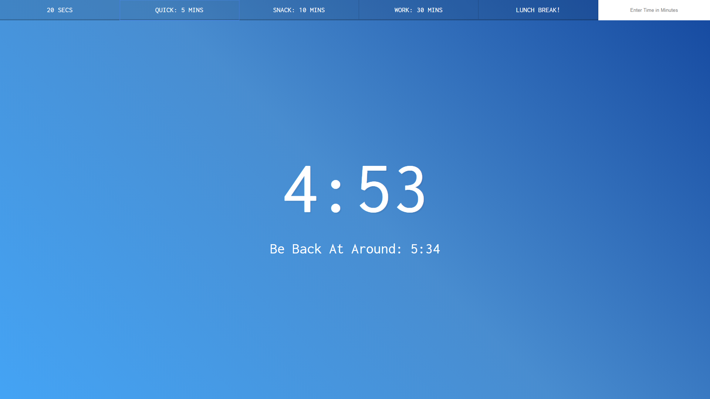
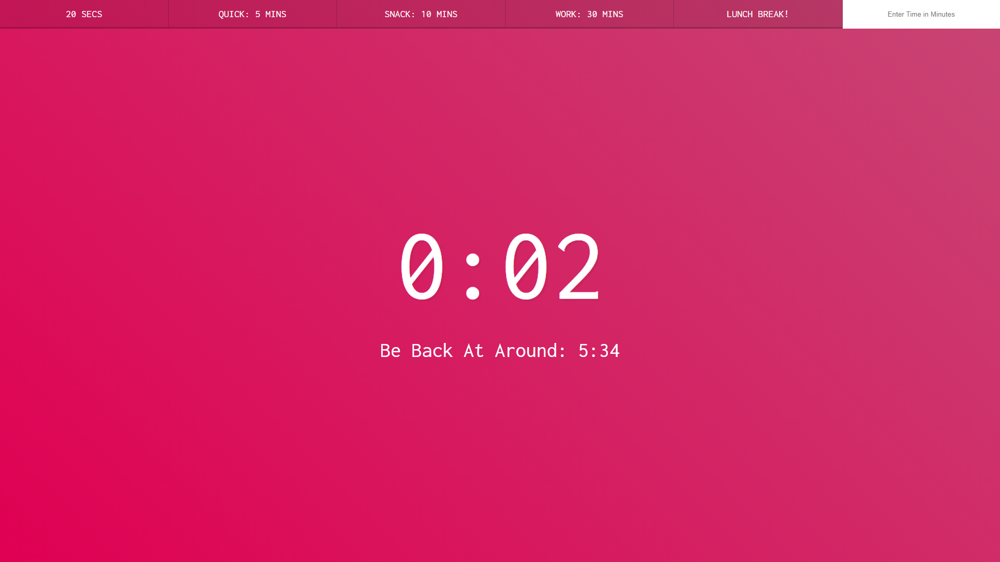
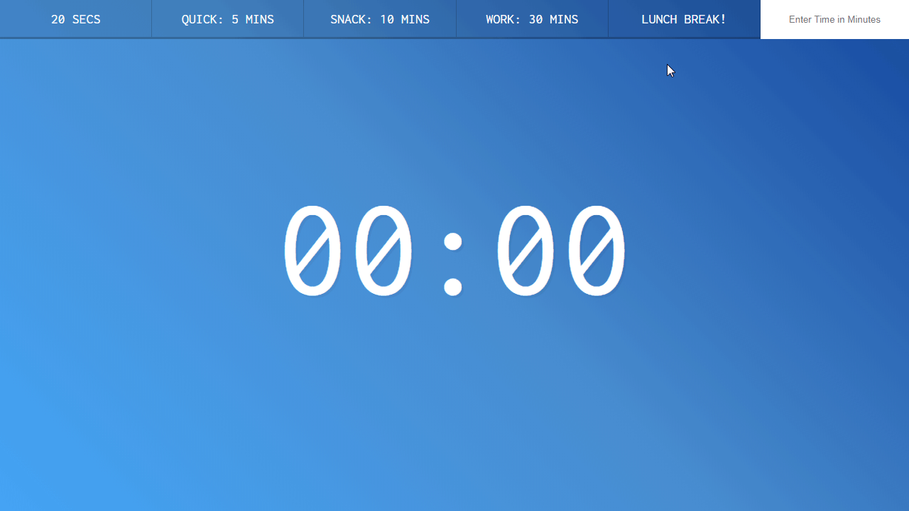

# Countdown Timer

### Using JavaScript, a countdown timer is created that will play audio once the timer hits zero.

The user is offered several preset buttons that will begin a timer, counting down to zero. An alarm will play once the timer runs out.

<a href="https://github.com/ynoTL23/JavaScript30">Main repo</a>

### Screenshot
---
> **The default look**

> **Countdown begins**

> **Time's running out**

### Demo
---
