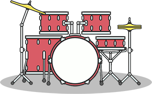
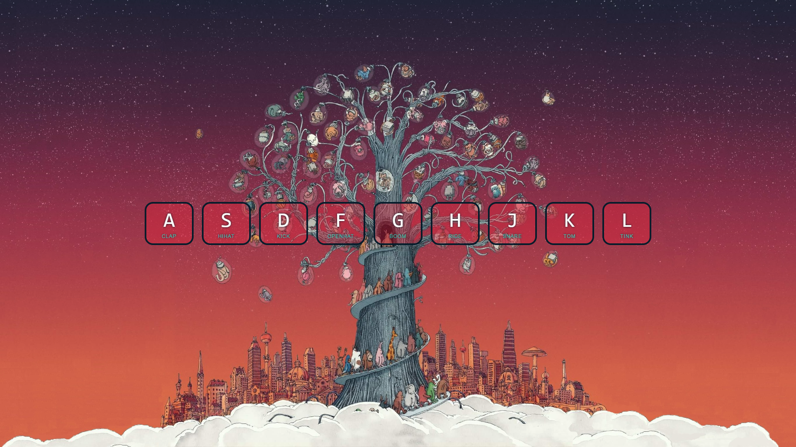
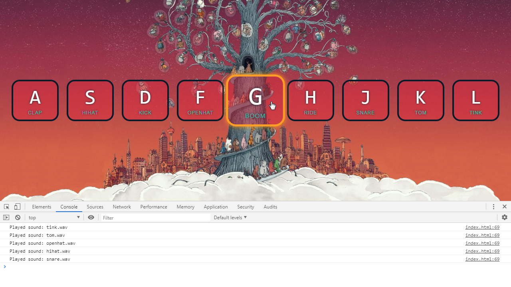
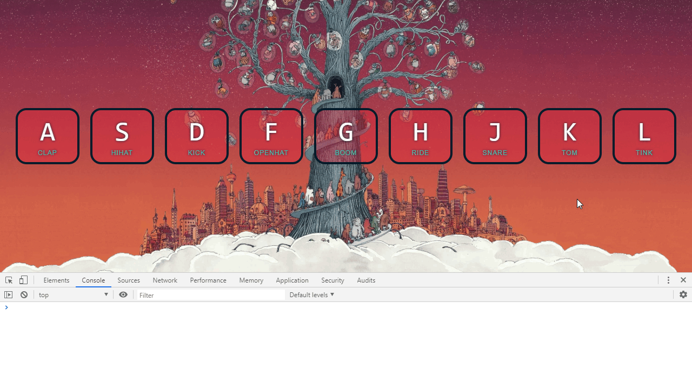

 
# JavaScript Drum Kit

#### A virtual drum kit created with JavaScript as part of the 30 days of JavaScript challenge.

The project displays a row of keys, each mapped to a specific sound. When the corresponding key is pressed, the button will light up and a sound will play.
Alternatively, the buttons can be clicked instead rather than using a keyboard.

### Screenshots
---
> **The default look**

> **Button / key interaction via mouse**

### Demo
---

