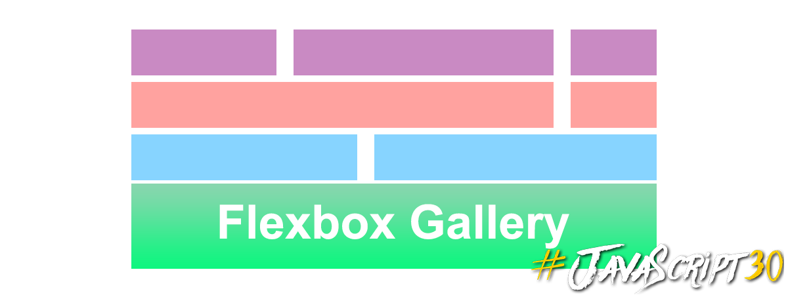
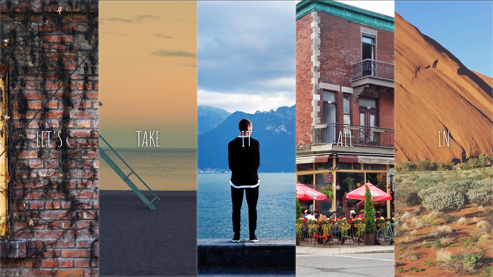
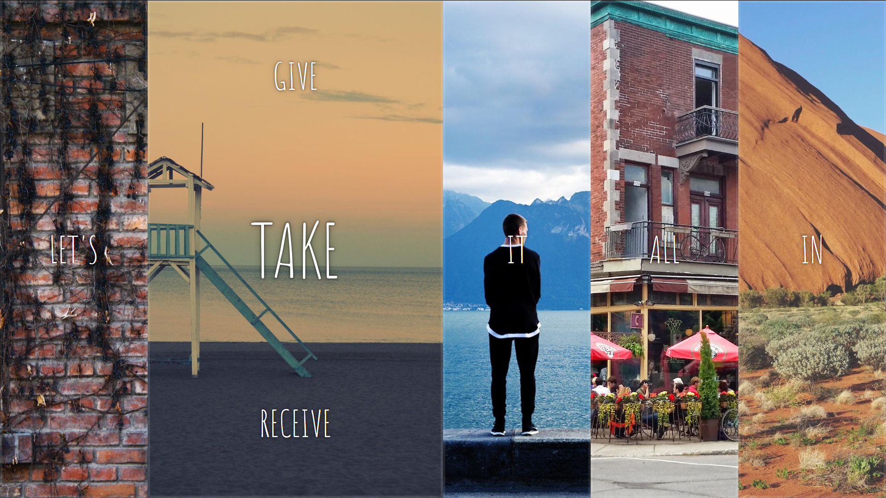

<p align="center"></p>

# Flex Box Gallery

### This challenge explores the capabilities of CSS's flexible boxes, or flex box. JavaScript is then used to bring interactivity.

Various panels are placed side by side using flexbox and its properties. When clicked, the panels will expand and text will come into view.

The HTML has *div* with `panels` as a class that holds 4 more *div*s of class `panel panelX`, where *X* is numerically increasing from 1 to 5. This gives us a barebones layout of the site; each panel is stacked on top of one another.

We then head over into our CSS to setup our flex boxes. We configure `.panels` with `display: flex` to configure the panels side-by-side.

Our next issue to solve is spreading the panels evenly across the screen. To do that, we head over to `.panel` in our CSS and add `flex: 1` . Next is to center our text and stack them on top of each other, we simply add the following under the same class, `.panel`:
```CSS
justify-content: center;
align-items: center;
display: flex;
flex-direction: column;
```

Now we focus on JavaScript to make everything work. We select all our panels with `document.querySelectorAll('.panel')` and for each panel, we add an event listener that will execute 2 functions when the panel is clicked. Those functions are:
```JavaScript
// Expands the panel
function toggleOpen() {
    this.classList.toggle('open');
}

// Pulls in text after the expansion
function toggleActive(e) {
    if (e.propertyName.includes('flex')) {
        this.classList.toggle('open-active');
    }
}
```

And we're done.

<p align="center"><a href="https://github.com/ynoTL23/JavaScript30">Main repo</a></p>

### Screenshot
---
> **The default look**


> **Expanded view**


### Demo
---
