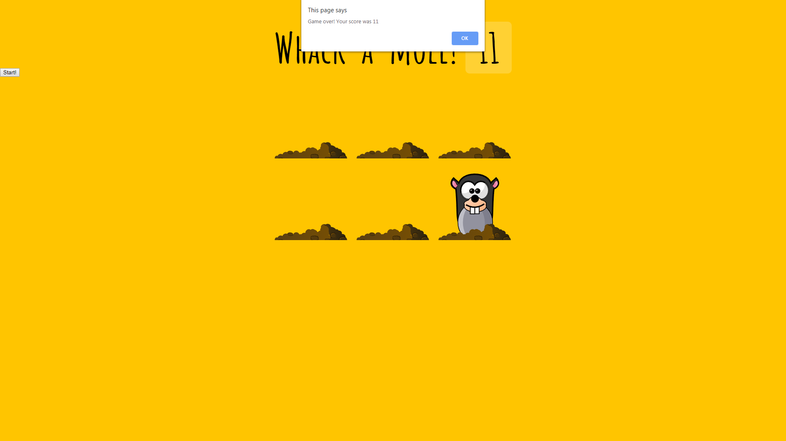

# Whack A Mole

### A small Whack A Mole game made with JavaScript.

The page loads with some holes that moles will pop out of. After pressing the "Start Game" button, moles will randomly pop out of the holes. The objective is same as always: hit the moles as soon as they appear. The game ends after 10 seconds and the score is tracked at the very top of the page.

<a href="https://github.com/ynoTL23/JavaScript30">Main repo</a>

### Screenshot
---
> **The default look**

> **A mole shows itself**

> **Game over!**

### Demo
---
